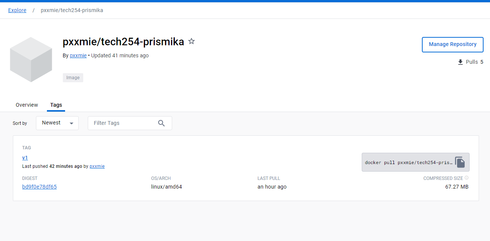

### Add profile to index.html on local machine:

- Open your gitbash terminal, naviagte to the folder you have created. Now create a index.html file. 

    ```bash
    nano index.html
    ```

- Edit the index.html file to add your docker profile, save and exit the file.

   

- In the same folder where your index.html is, create a Dockerfile

    ```
    touch Dockerfile

    nano Dockerfile
    ```

- In the Dockerfile, copy the following script, save and exit the file. 
  
    

### Build the Docker Image

- In the terminal, navigate to the directory containing your Dockerfile and index.html, and run:

    ```
    docker build -t your_username/image_name:tag .
    ```
    

### Push to Docker Hub

Before pushing the image, you need to **tag it** with your Docker Hub username and the repository name. 

```bash
docker tag tech254-prismika pxxmie/tech254-prismika:v1
```

Push the Image:

This command will upload your image to Docker Hub.
```
docker push pxxmie/tech254-prismika:v1
```

### Verify on Docker Hub

After the push is successful, you should be able to see your image on Docker Hub in the repository you specified.



### Running your image from gitbash 

Copy the pull command from your docker hub into your terminal: 

```
docker pull pxxmie/tech254-prismika:v1
```


We've mapped port 100 on your local machine to port 80 inside the container.

You can now access your Nginx server with new image by navigating to http://localhost:100 in your web browser.

```bash 
$ docker run -d -p 100:80 pxxmie/tech254-prismika:v1
8429e265982acaa4c12c903744db7b4cad08396dd37aaaf9ca491a8e33bcb5e3
```


