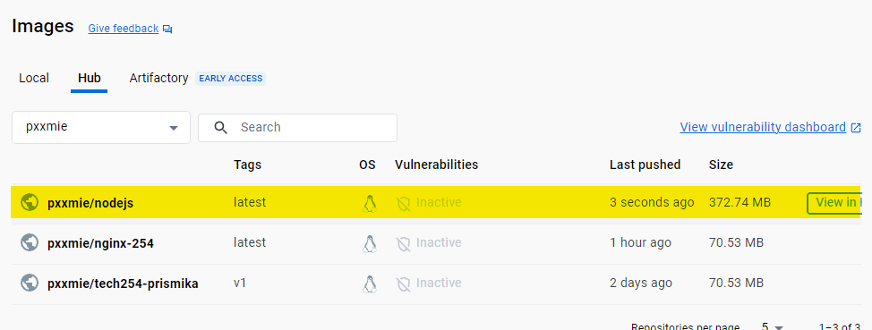

# Dockerising Node.js Applications

In this guide I will be showing how to  create Dockerfile inside my appjs folder, and pushing it to Docker Hub.

## Step 1: App Folder

First, I have copied my app folder in a new folder in my local machine. Then navigated into the directory where my app.js file is. 


## Step 2: Create Docker File 

Within my app folder, I have then created a new Dockerfile, by running the following command. 

```
nano Dockerfile
```

```bash
# Node version
FROM node:12

# Set the working directory in the container
WORKDIR /usr/src/app

# Copy package.json and package-lock.json to the working directory
COPY package*.json ./

# Install app dependencies
RUN npm install

# Copy the rest of the application code to the working directory
COPY . .

# Expose the port that the app runs on
EXPOSE 3000

# Command to run the app
CMD [ "node", "app.js" ]

```
## Step 3: Build and tag the Docker Image 

Make sure you are still in the directory containing your Dockerfile and app.js file. Then, run the following command to build the Docker image:

```bash
 docker build -t pxxmie/nodejs .
```

## Step 4: Check Image has been buit

We can make sure our image has been built by running the following command: 

```
docker images
```


## Step 5: Run the Docker Container

This command tells Docker to run a container based on your image and forward port 3000 on your local machine to port 3000 in the container.

```
docker run -d -p 3000:3000 pxxmie/nodejs
c2ee909218381407534d0457520668873928b7838ea41b16927bb7c6937c69d3
```

Open a web browser and go to http://localhost:3000. You should see your Node.js application running


### Step 6: Push Image to Dockerhub

After the image has been built, you can push it to Docker Hub using the following command:

```
docker push pxxmie/nodejs
```

You can see your pushed image on Docker hub.



