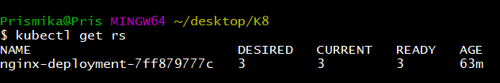

# Kubernetes Deployment 

### Step 1: Create YAML file (Deployment)

On my git bash I have created a new folder for my K8 deployment and created a new YAML file inside it. 

In the YAML file, specify the API version, kind, metadata (including the name of the Deployment), and the specifications for your Deployment. Include details like the number of replicas, label selectors, container specifications, and any other relevant information.

```
nano nginx-deployment.yml
```


```bash
apiVersion: apps/v1 # Specifies the API version for the Kubernetes resource (Deployment)
kind: Deployment # Defines the kind of resource (Deployment)
metadata:
  name: nginx-deployment # Sets the name of the Deployment

spec:
  selector: 
    matchLabels: 
      app: nginx # Label selector to match pods managed by this Deployment
  replicas: 3 # Number of identical pods to run (desired state)

  template: # Describes the pods managed by this Deployment
    metadata:
      labels:
        app: nginx # Label to apply to the pods

    spec: # Specifications for the pod template
      containers: # List of containers to run in the pod
      - name: nginx # Name of the container
        image: pxxmie/nginx-254:latest # Docker image to use for the container
        ports: 
        - containerPort: 80 # Port the container will listen on
```

### Step 2: Create a Deployment

Lets make sure our Kubernetes cluster is up and running. By running this command creates the Deployment:

```bash
kubectl create -f nginx-deployment.yml
```
Output: 


### Step 3: Check Deployment 

We can check if the deployment was created by running the following command.

```
kubectl get deployments
```

Output:


### Step 4: Check ReplicaSet 

To see the ReplicaSet (rs) created by the Deployment, run the following command: 

```
kubectl get rs
```


 

`DESIRED` displays the desired number of replicas of the application, which you define when you create the Deployment. This is the desired state.

`CURRENT` displays how many replicas are currently running.

`READY` displays how many replicas of the application are available to your users.

### Step 5: Check Pods

This displays information about the pods that are currently running in your Kubernetes cluster. 

```
kubectl get pods
```


 

### Testing 

If we delete a pod, it will automatically detect the pod's termination and take action to maintain the desired number of replicas, in this case 3. 

It will create a new pod to replace the one that was deleted.

