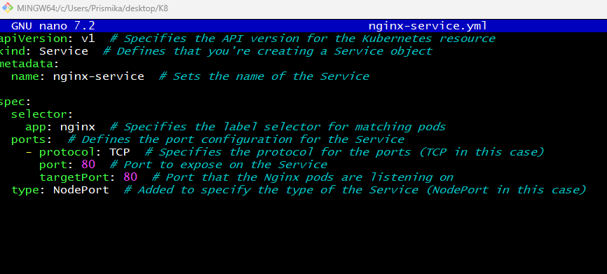
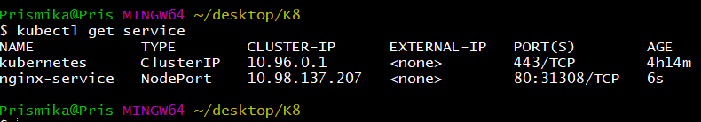
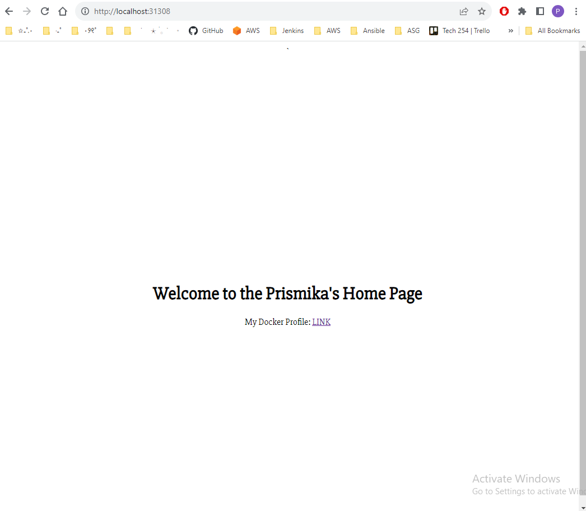

# Kubernetes Deployment- Creating a Service 

Now, that we have created our deployment, we want to access it from outside our cluster and from the internet, therefore we need to create a Service for our deployment. 

## Step 1: Defining a Service

In the same folder, where we have our deployment YAML file, we will now need to create another one for Service. 

```
nano nginx-service.yml
```



```bash
apiVersion: v1  # Specifies the API version for the Kubernetes resource
kind: Service  # Defines that you're creating a Service object
metadata:
  name: nginx-service  # Sets the name of the Service

spec:
  selector:
    app: nginx  # Specifies the label selector for matching pods
  ports:  # Defines the port configuration for the Service
    - protocol: TCP  # Specifies the protocol for the ports (TCP in this case)
      port: 80  # Port to expose on the Service
      targetPort: 80  # Port that the Nginx pods are listening on
  type:nodePort 

```
## Step 2: Create Service 

Now we want to instruct Kubernetes to create a Service based on the configuration defined in our service YAML file. 

```
 kubectl create -f nginx-service.yml
```

If there were no errors, the Service should now be created in your Kubernetes cluster. You can verify this by running:

```
kubectl get services
```

Output:



## Step 3: Access our Deployment 

Once the Service is created and successfully provisioned, we can access it on our local host followed by the port specified. 

