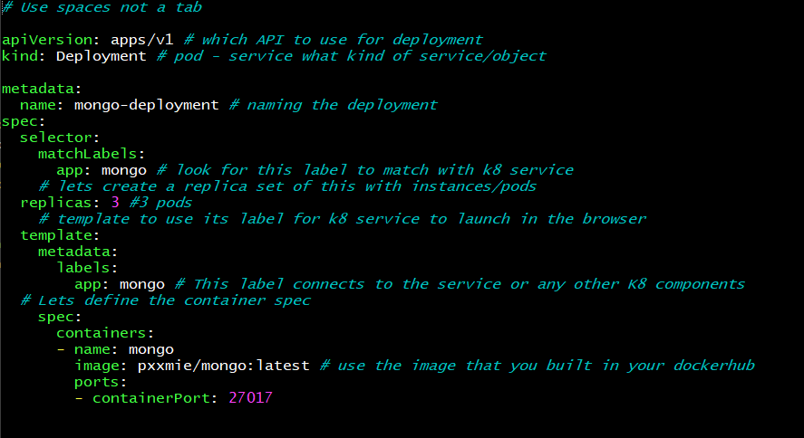
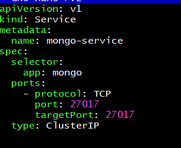
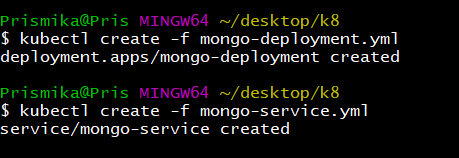
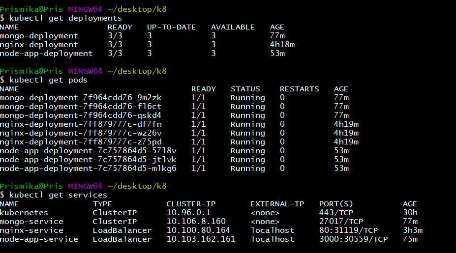
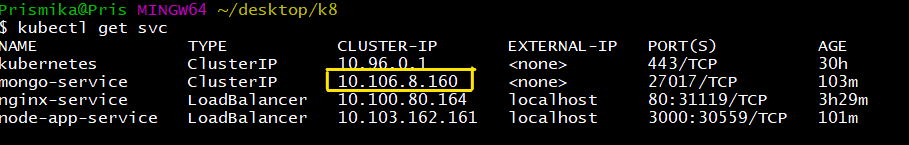
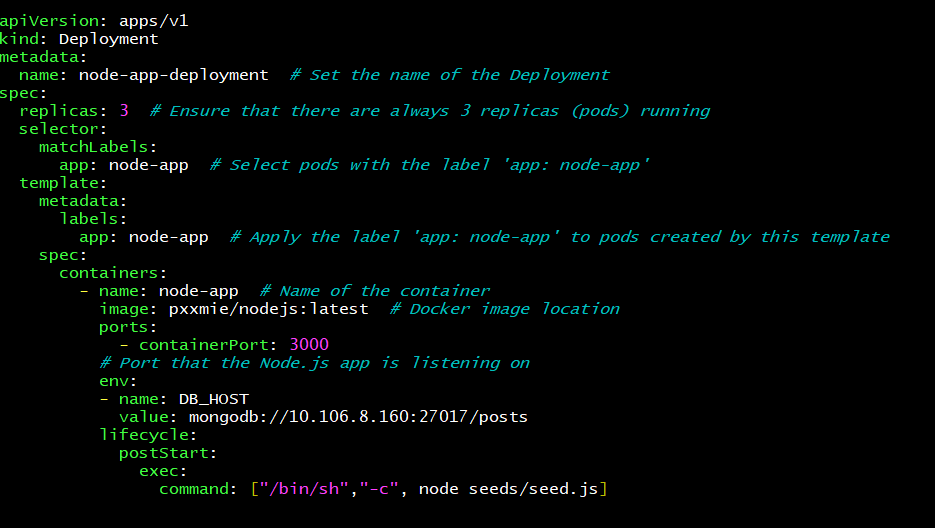
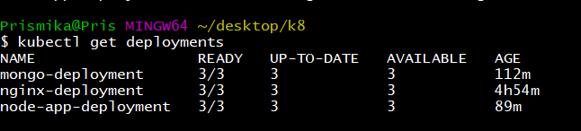
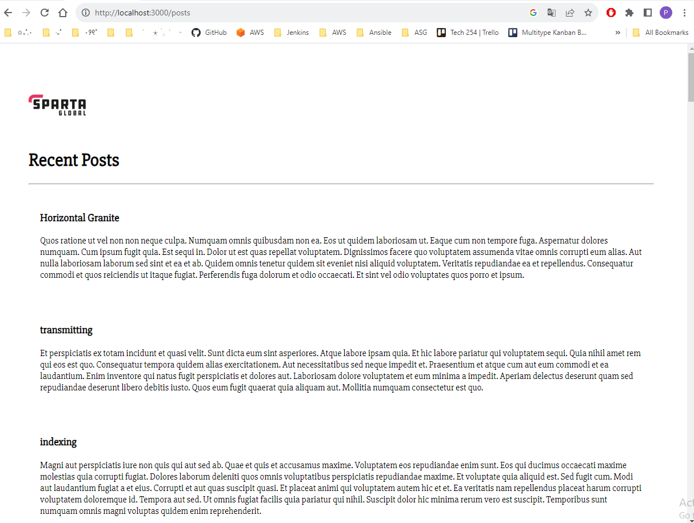

# MongoDB on Kubernetes Cluster

Now that we have created our nginx and node app deployment and services in our Kubernetes cluster, we are going to create our mongodb deployment.


## Step 1: Create MongodB Deployment 

On your gitbash terminal, on the same folder create a mongo deployment YAML file. 

```
nano mongo-deployment.yml
```

```bash
# Use spaces not a tab

apiVersion: apps/v1 # which API to use for deployment
kind: Deployment # pod - service what kind of service/object

metadata:
  name: mongo-deployment # naming the deployment
spec:
  selector:
    matchLabels:
      app: mongo # look for this label to match with k8 service
    # lets create a replica set of this with instances/pods
  replicas: 3 #3 pods
    # template to use its label for k8 service to launch in the browser
  template:
    metadata:
      labels:
        app: mongo # This label connects to the service or any other K8 components
  # Lets define the container spec
    spec:
      containers:
      - name: mongo
        image: pxxmie/mongo:latest # use the image that you built in your dockerhub
        ports:
        - containerPort: 27017
```



## Step 2: Create Mongodb Service

Now, we are going to create our mongdb service file in YAML. This will create a service named mongo-service that will forward traffic to pods with the label app: mongo on port 27017

```
nano mongo-service.yml
```

```bash
apiVersion: v1 #Specifies the API version for the service.
kind: Service #Indicates that this is a service resource.
metadata: #Contains metadata information for the service.
  name: mongo-service #Sets the name of the service to "mongo-service".
spec: #Specifies the service's specifications.
  selector:
    app: mongo
  ports: #Specifies the ports to open for the service.
    - protocol: TCP
      port: 27017
      targetPort: 27017
  type: ClusterIP #Sets the service type to ClusterIP, which makes it accessible only within the cluster.

```



## Step 3: Create the Mongo Deployment and Service to K8 Cluster

Now we want to create this in our cluster, this will apply the configurations defined in mongo-deployment.yml and mongo-service.yml to our Kubernetes cluster.

```bash
kubectl create -f mongo-deployment.yml 
kubectl create -f mongo-service.yml
```



You can verify the deployment and service status by running the following commands:

```bash
kubectl get deployments
kubectl get pods
kubectl get svc
```



## Step 4: Edit Nodejs deployment file

Now we need to add environment variables to our Node.js deployment YAML file, we need to include a spec.containers.env section. 

This is where you can specify the environment variables that your Node.js application will use to connect to MongoDB.


First, we need to find the IP of our mongodb by running the following command and then we want to copy our mongo IP as we are going to add this on our env var. 

```
kubectl get svc
```


```
nano nodeapp-deployment.yml 
```

Scroll down on your deployment file and add the env under spec and copy the mongo IP. Followed by the seed command. 

```bash
plate
    spec:
      containers:
        - name: node-app  # Name of the container
          image: pxxmie/nodejs:latest  # Docker image location
          ports:
            - containerPort: 3000
          # Port that the Node.js app is listening on
          env:
          - name: DB_HOST
            value: mongodb://10.106.8.160:27017/posts
          lifecycle:
            postStart:
              exec:
                command: ["/bin/sh","-c", node seeds/seed.js]

```
Now our final node deployment file should look like this. Save and exit. 



Delete the nodeapp deployment and recreate it so its updated with the new service. 

```bash
kubectl delete -f nodeapp-deployment.yml

kubectl create-f nodeapp-deployment.yml
```

Verify that the deployment has been updated:

```
kubectl get deployments
```



## Step 5: Testing Mongodb 

Now we can finally access our Mongodb on our browser by entering  http://localhost:3000/posts

