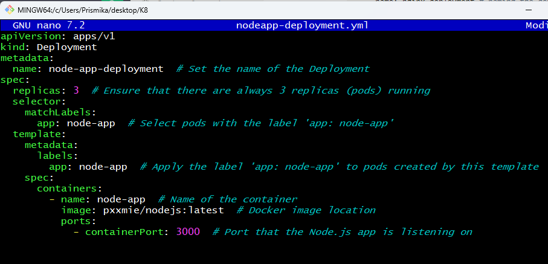
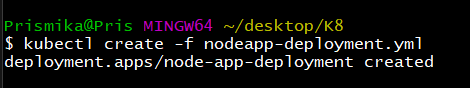
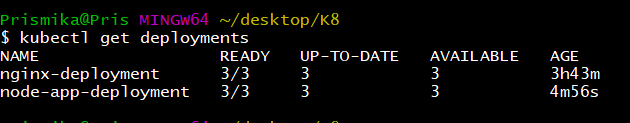
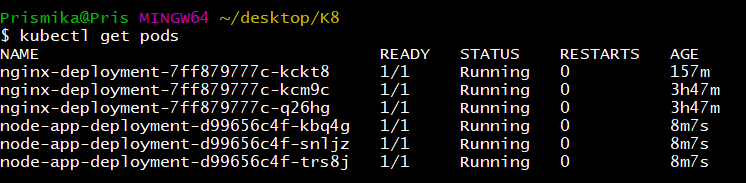
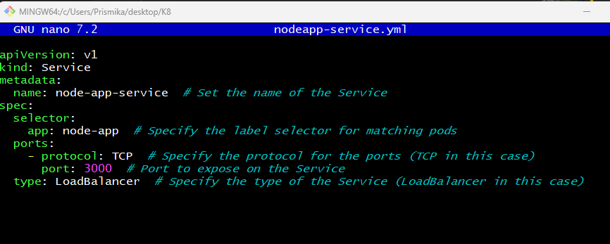
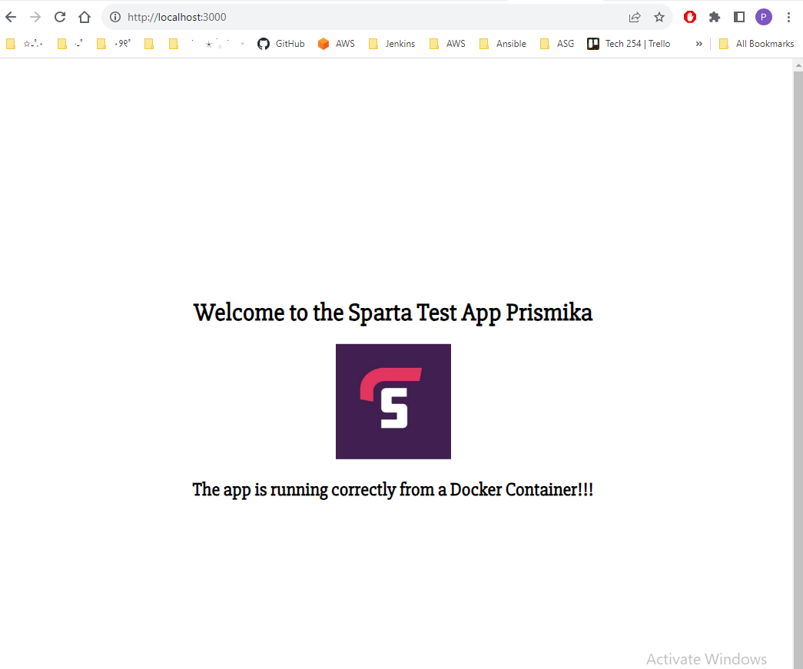

# Deploy Nodejs application in the same Kubernetes cluster

## Step 1: Create a Docker Image
- Dockerise your Node.js application. This involves creating a Dockerfile to build an image of your Node.js app. 
  
- Build and push the Docker image to your Docker Hub. 

## Step 2: Create a Kubernetes Deployment for Your Node.js App

- Create a new YAML file to define a Deployment for your Node.js application.Specify the container image you built in step 1 in the YAML file.

    ``` 
    nano nodeapp-deployment.yml
    ```

    ```bash
    apiVersion: apps/v1
    kind: Deployment
    metadata:
    name: node-app-deployment  # Set the name of the Deployment
    spec:
    replicas: 3  # Ensure that there are always 3 replicas (pods) running
    selector:
        matchLabels:
        app: node-app  # Select pods with the label 'app: node-app'
    template:
        metadata:
        labels:
            app: node-app  # Apply the label 'app: node-app' to pods created by this template
        spec:
        containers:
            - name: node-app  # Name of the container
            image: pxxmie/nodejs:latest  # Docker image location
            ports:
                - containerPort: 3000  # Port that the Node.js app is listening on
    ```

    

### Step 3: Create the Deployment 

- Now we need to create the nodejs deployment to our cluster by running the following command. 

    ```
    kubectl create -f nodeapp-deployment.yml
    ```

    

- We can get some information on our nodejs deployments in our  Kubernetes cluster by running the following command:

    ```
    kubectl get deployments
    ```

    

- We can also get some information about our nodejs deployment running in the pods in our Kubernetes cluster by running the following command: 
  
    ```
    kubectl get pods
    ```

    

## Create a Service for our Nodejs deployment 

Now that we have created our nodejs deployment, we will create a service in order to access our application over the internet. 

### Step 1: Create YAML file 

- In the same folder, where we have our nodejs deployment file, we will now need to create another file for Service. 

    ```bash
    apiVersion: v1
    kind: Service
    metadata:
    name: node-app-service  # Set the name of the Service
    spec:
    selector:
        app: node-app  # Specify the label selector for matching pods
    ports:
        - protocol: TCP  # Specify the protocol for the ports (TCP in this case)
        port: 3000  # Port to expose on the Service
    type: LoadBalancer  # Specify the type of the Service (LoadBalancer in this case)
    ```

    

### Step 2: Access Nodejs application through browser

- On your browser, type localhost:3000 and your nodejs application should appear. 

    