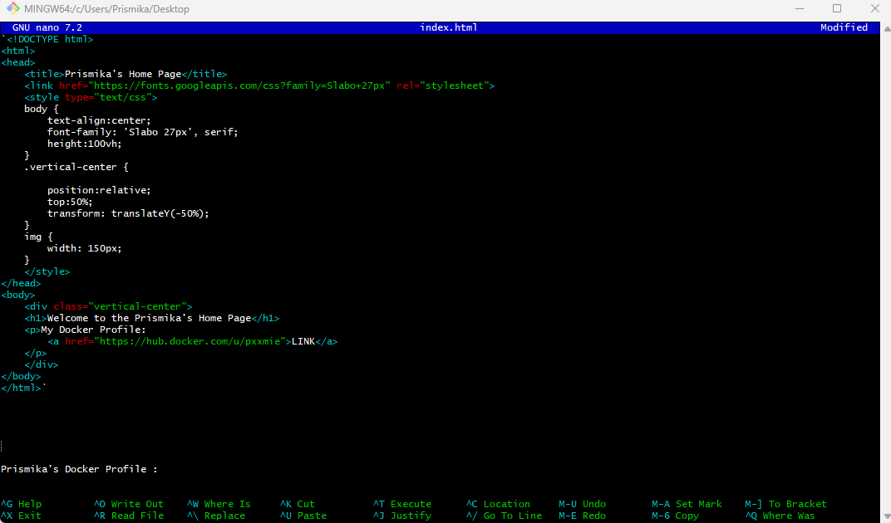
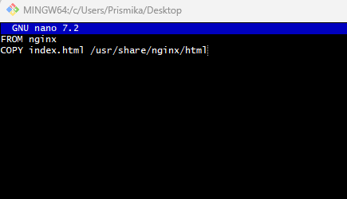

# Creating an index.html, Dockerfile and Pushing to Docker Hub

In this guide, Ill will show you how to create a  index.html file in your local machine, build a Docker image with it, and push the image to Docker Hub.

### Create the index.html file on local machine:

  Open your gitbash terminal, Create a new file named index.html.

```bash
 nano index.html
```

  Edit the index.html file to add your docker profile, save and exit the file.

   

### Create a Dockerfile

  In the same folder where your index.html is, create a Dockerfile

```
touch Dockerfile

nano Dockerfile
```

In the Dockerfile, add the following content- save and exit.
  
    

### Build the Docker Image

In the terminal, navigate to the directory containing your Dockerfile and index.html, and run the command to build your docker image:

```
docker build -t your_username/image_name:tag .
```


### Tag the image

Before pushing the image, you need to **tag it** with your Docker Hub username and a desired repository name. 

```bash
docker tag tech254-prismika pxxmie/tech254-prismika:v1
```

### Push the Image to Docker Hub

This command will upload your image to Docker Hub.
```
docker push pxxmie/tech254-prismika:v1
```

### Verify on Docker Hub

After the push is successful, you should be able to see your image on Docker Hub in the repository you specified.


### Pulling the Docker Image

Copy the pull command from your docker hub into your terminal: 

```
docker pull pxxmie/tech254-prismika:v1
```


### Running a Container from the Pulled Image

Map port 100 on your local machine to port 80 inside the container.

```bash 
$ docker run -d -p 100:80 pxxmie/tech254-prismika:v1
8429e265982acaa4c12c903744db7b4cad08396dd37aaaf9ca491a8e33bcb5e3
```

You can now access your Nginx server with new image by navigating to http://localhost:100 in your web browser.


