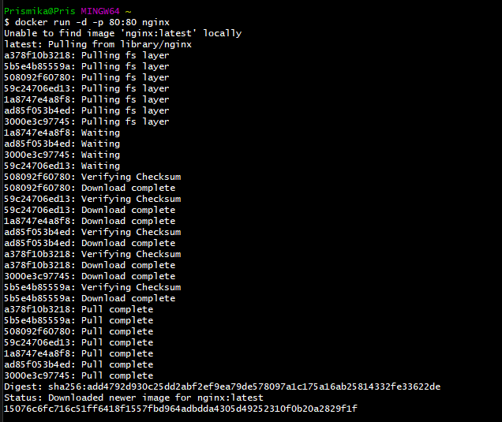
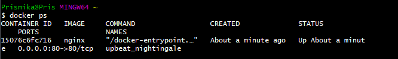
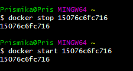
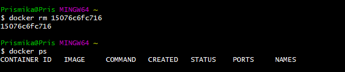
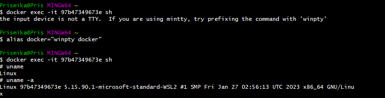

## Setting up Docker

### Download Docker for Windows (link)

[Download for Windows](https://desktop.docker.com/win/main/amd64/Docker%20Desktop%20Installer.exe?utm_source=docker&utm_medium=webreferral&utm_campaign=dd-smartbutton&utm_location=module&_gl=1*40czeb*_ga*MjEyNDk2NTk3MS4xNjk4NjU5MTcw*_ga_XJWPQMJYHQ*MTY5ODY3NDM1Ni41LjEuMTY5ODY3NjI1Ny41My4wLjA.)

Open your gitbash terminal and run the following command to make sure Docker has been downloaded. 

```bash
$ docker --version
Docker version 24.0.6, build ed223bc
```

### Running Nginx in a Docker Container

```bash
$ docker run -d -p 80:80 nginx
68206eeac64ba31df5225ba3da46790ae089f2f8f77f9c248dcc293fc32d9b99

Prismika@Pris MINGW64 ~/Desktop
$ docker ps
CONTAINER ID   IMAGE     COMMAND                  CREATED          STATUS          PORTS                NAMES
68206eeac64b   nginx     "/docker-entrypoint.…"   13 seconds ago   Up 13 seconds   0.0.0.0:80->80/tcp   friendly_elgamal
```



### Access Nginx from local host

Open your web browser and navigate to http://localhost. You should see the 
default Nginx welcome page.


### Stop and Start the Container 


```
docker ps 
```




```
docker stop <CONTAINERID>

docker start <CONTAINERID>
```


### Remove the container

```
docker rm <CONTAINERID> -f
```


### Access the Shell inside the Docker container


```bash
docker exec -it 97b47349673e sh
```



Install Dependencies: 

```
apt update 

apt upgrade -y 

apt install sudo

apt install nano
```
